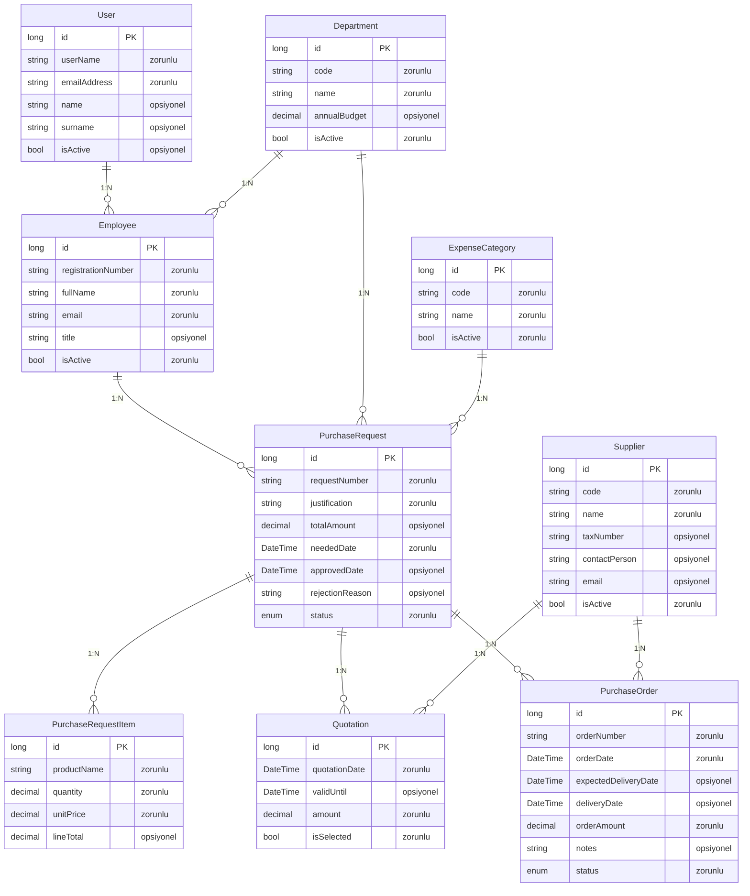
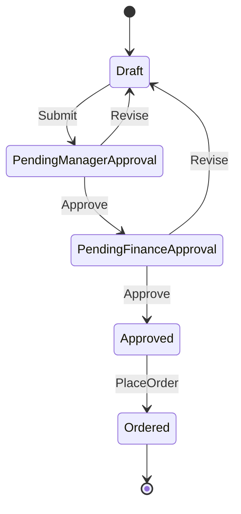
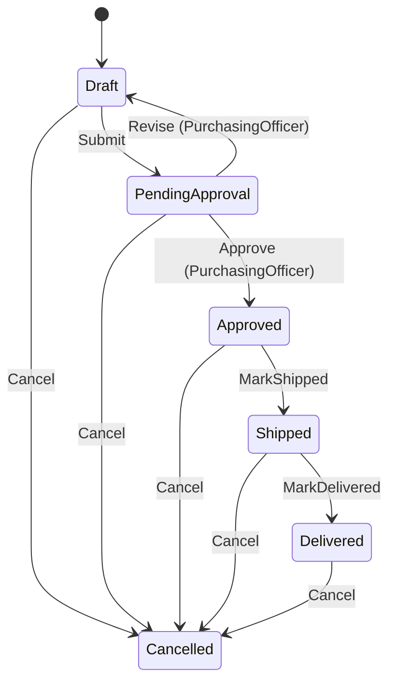
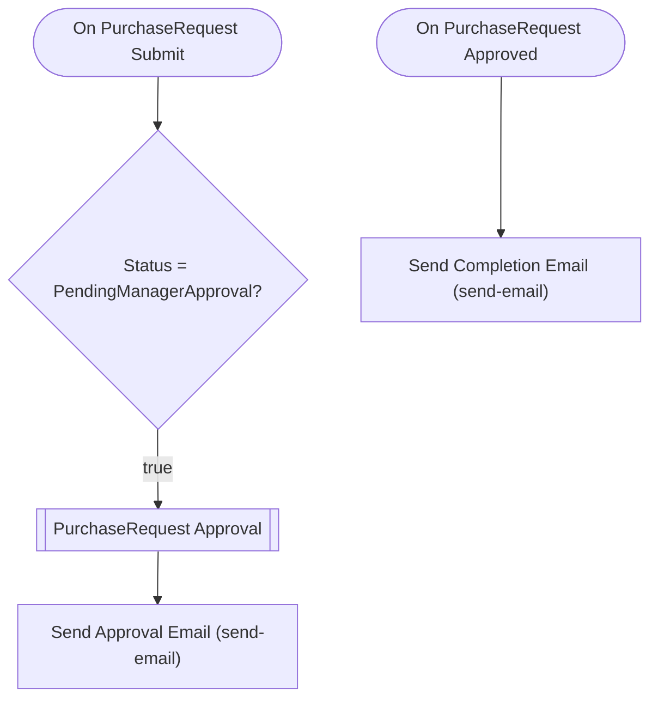
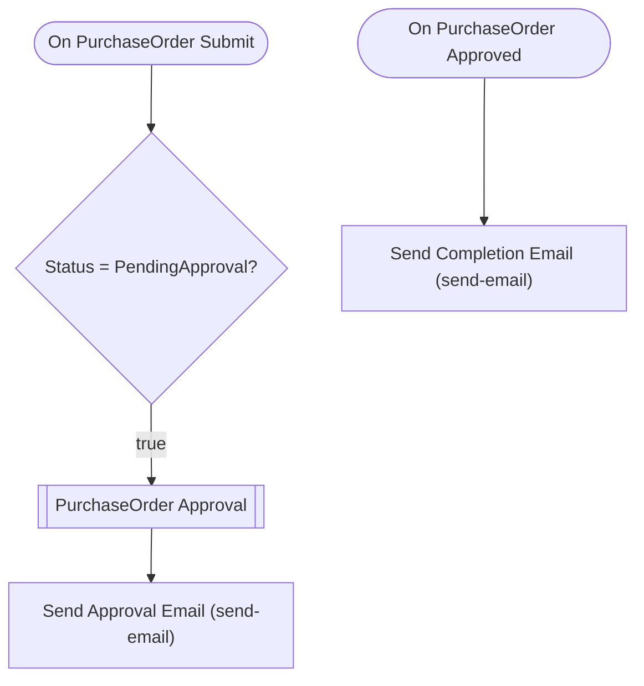

# directordemo2 — Talep Analizi

> Bu belge Archipid talep olgunlaştırma (discovery) akışıyla üretildi.

## Orijinal Talep

Kurumsal bir "Satın Alma Talep ve Onay Yönetim Sistemi" istiyorum.

## Master data / parametre entity'leri:

- Department (Birim): birim kodu, birim adı, yıllık bütçe, aktif/pasif
- Employee (Personel): sicil numarası, ad soyad, e-posta, birim (Department
  ilişkili), unvan, aktif/pasif
- Supplier (Tedarikçi): tedarikçi kodu, tedarikçi adı, vergi numarası,
  iletişim kişisi, e-posta, aktif/pasif
- ExpenseCategory (Harcama Kalemi): kalem kodu, kalem adı (örn. BT Donanım,
  Danışmanlık, Sarf Malzeme), aktif/pasif

## Operasyonel entity'ler:

- PurchaseRequest (Satın Alma Talebi): talep numarası, talep eden (Employee
  ilişkili), talep eden birim (Department ilişkili), harcama kalemi
  (ExpenseCategory ilişkili), gerekçe, toplam tutar, ihtiyaç tarihi,
  red gerekçesi, durum
- PurchaseRequestItem (Talep Kalemi): talep (PurchaseRequest ilişkili),
  ürün/hizmet adı, miktar, birim fiyat, satır tutarı — bir talepte birden
  fazla kalem olabilir
- Quotation (Teklif): talep (PurchaseRequest ilişkili), tedarikçi (Supplier
  ilişkili), teklif tutarı, teklif tarihi, seçildi mi
- PurchaseOrder (Sipariş): talep (PurchaseRequest ilişkili), sipariş numarası,
  tedarikçi (Supplier ilişkili), sipariş tarihi, teslim tarihi, sipariş tutarı

Toplam 8 entity olsun, fazlasını ekleme.

## RBAC rolleri:

Requester (Talep Eden), DepartmentManager (Birim Müdürü), FinanceApprover
(Finans Onaycısı), PurchasingOfficer (Satın Alma Sorumlusu) sistem rolleri olsun.

## Onay akışı (state machine) — PurchaseRequest için:

Draft → PendingManagerApproval → PendingFinanceApproval → Approved → Ordered

Onay adımları ROL bazlı olsun:

- PendingManagerApproval adımı DepartmentManager rolüne atansın.
- PendingFinanceApproval adımı FinanceApprover rolüne atansın.
- Approved → Ordered geçişini PurchasingOfficer rolü yapsın.
- Herhangi bir onaycı reddederse talep Draft'a geri dönsün (revizyon) ve
  red gerekçesi zorunlu olsun.

Kural: Draft'tan onaya göndermek için talebin en az bir PurchaseRequestItem
kaydı bulunsun.
Kural: Approved'dan Ordered'a geçmek için talebin seçilmiş en az bir Quotation
kaydı bulunsun.

## Dashboard:

- Onayımı bekleyen talep sayısı
- Durum bazında talep dağılımı
- Birim bazında talep tutarı dağılımı
- Ortalama onay süresi (gün) — talep tarihinden onay tarihine
- İhtiyaç tarihi geçmiş, hâlâ onaylanmamış talepler listesi

## Raporlar:

- Talep onay formu (PDF): talep bilgileri, kalemler, teklifler, onay geçmişi

## Özet

Bu uygulama, kurumsal satın alma taleplerini dijital ortamda uçtan uca yönetir. Çalışanlar ihtiyaç duydukları ürün veya hizmetleri sisteme girer; talepler birim müdürü ve finans departmanı tarafından onaylanır, ardından tedarikçilerden teklif toplanarak siparişe dönüştürülür ve teslimat süreci takip edilir.

Talep eden çalışan bir satın alma talebi oluşturur ve kalemlerini ekledikten sonra onaya gönderir. Talep önce birim müdürüne, ardından finans ekibine iletilir; her iki onay tamamlanınca talep 'Onaylandı' durumuna geçer. Satın alma sorumlusu tedarikçilerden teklif toplar, birini seçer ve siparişi oluşturarak onaya gönderir. Sipariş onaylandıktan sonra kargoya verildiğinde 'Kargoda', teslim alındığında 'Teslim Edildi' olarak işaretlenir. Teslim tarihi girilmiş teklifler için geçerlilik süresi takip edilebilir. Herhangi bir aşamada reddedilirse talep veya sipariş, gerekçesiyle birlikte ilgili kişiye geri döner ve düzeltilerek tekrar onaya gönderilebilir; deneme sayısında sınır yoktur.

## Kapsam

- (belirtilmedi)

## Kapsam Dışı

- (belirtilmedi)

## Açık Noktalar

- (belirtilmedi)

## Eksiklikler

- (belirtilmedi)

## Öneriler

- (belirtilmedi)

## Veri Modeli

### User — Kullanıcı (Sistem)

| Alan | Tip | Zorunlu | Uzunluk |
|---|---|---|---|
| `id` | long | Evet | — |
| `userName` | string | Evet | 64 |
| `emailAddress` | string | Evet | 256 |
| `name` | string | Hayır | 128 |
| `surname` | string | Hayır | 128 |
| `isActive` | bool | Hayır | — |

**Neye bağlı:** Employee (1:N, bu tablo "bir" tarafı)

### Department — Birim

| Alan | Tip | Zorunlu | Uzunluk |
|---|---|---|---|
| `id` | long | Evet | — |
| `code` | string | Evet | 20 |
| `name` | string | Evet | 200 |
| `annualBudget` | decimal | Hayır | — |
| `isActive` | bool | Evet | — |

**Neye bağlı:** Employee (1:N, bu tablo "bir" tarafı) · PurchaseRequest (1:N, bu tablo "bir" tarafı)

### Employee — Personel

| Alan | Tip | Zorunlu | Uzunluk |
|---|---|---|---|
| `id` | long | Evet | — |
| `registrationNumber` | string | Evet | 50 |
| `fullName` | string | Evet | 200 |
| `email` | string | Evet | 256 |
| `title` | string | Hayır | 100 |
| `isActive` | bool | Evet | — |

**Neye bağlı:** User (1:N, bu tablo "çok" tarafı) · Department (1:N, bu tablo "çok" tarafı) · PurchaseRequest (1:N, bu tablo "bir" tarafı)

### Supplier — Tedarikçi

| Alan | Tip | Zorunlu | Uzunluk |
|---|---|---|---|
| `id` | long | Evet | — |
| `code` | string | Evet | 20 |
| `name` | string | Evet | 200 |
| `taxNumber` | string | Hayır | 20 |
| `contactPerson` | string | Hayır | 200 |
| `email` | string | Hayır | 256 |
| `isActive` | bool | Evet | — |

**Neye bağlı:** Quotation (1:N, bu tablo "bir" tarafı) · PurchaseOrder (1:N, bu tablo "bir" tarafı)

### ExpenseCategory — Harcama Kalemi

| Alan | Tip | Zorunlu | Uzunluk |
|---|---|---|---|
| `id` | long | Evet | — |
| `code` | string | Evet | 20 |
| `name` | string | Evet | 200 |
| `isActive` | bool | Evet | — |

**Neye bağlı:** PurchaseRequest (1:N, bu tablo "bir" tarafı)

### PurchaseRequest — Satın Alma Talebi

| Alan | Tip | Zorunlu | Uzunluk |
|---|---|---|---|
| `id` | long | Evet | — |
| `requestNumber` | string | Evet | 50 |
| `justification` | string | Evet | 1000 |
| `totalAmount` | decimal | Hayır | — |
| `neededDate` | DateTime | Evet | — |
| `approvedDate` | DateTime | Hayır | — |
| `rejectionReason` | string | Hayır | 1000 |
| `status` | enum (Draft,PendingManagerApproval,PendingFinanceApproval,Approved,Ordered) | Evet | — |

**Neye bağlı:** Employee (1:N, bu tablo "çok" tarafı) · Department (1:N, bu tablo "çok" tarafı) · ExpenseCategory (1:N, bu tablo "çok" tarafı) · PurchaseRequestItem (1:N, bu tablo "bir" tarafı) · Quotation (1:N, bu tablo "bir" tarafı) · PurchaseOrder (1:N, bu tablo "bir" tarafı)

### PurchaseRequestItem — Talep Kalemi

| Alan | Tip | Zorunlu | Uzunluk |
|---|---|---|---|
| `id` | long | Evet | — |
| `productName` | string | Evet | 300 |
| `quantity` | decimal | Evet | — |
| `unitPrice` | decimal | Evet | — |
| `lineTotal` | decimal | Hayır | — |

**Neye bağlı:** PurchaseRequest (1:N, bu tablo "çok" tarafı)

### Quotation — Teklif

| Alan | Tip | Zorunlu | Uzunluk |
|---|---|---|---|
| `id` | long | Evet | — |
| `quotationDate` | DateTime | Evet | — |
| `validUntil` | DateTime | Hayır | — |
| `amount` | decimal | Evet | — |
| `isSelected` | bool | Evet | — |

**Neye bağlı:** PurchaseRequest (1:N, bu tablo "çok" tarafı) · Supplier (1:N, bu tablo "çok" tarafı)

### PurchaseOrder — Sipariş

| Alan | Tip | Zorunlu | Uzunluk |
|---|---|---|---|
| `id` | long | Evet | — |
| `orderNumber` | string | Evet | 50 |
| `orderDate` | DateTime | Evet | — |
| `expectedDeliveryDate` | DateTime | Hayır | — |
| `deliveryDate` | DateTime | Hayır | — |
| `orderAmount` | decimal | Evet | — |
| `notes` | string | Hayır | 1000 |
| `status` | enum (Draft,PendingApproval,Approved,Shipped,Delivered,Cancelled) | Evet | — |

**Neye bağlı:** PurchaseRequest (1:N, bu tablo "çok" tarafı) · Supplier (1:N, bu tablo "çok" tarafı)

## İş Akışları

### Satın Alma Talebi — durum makinesi

**Onay adımları**

| # | Adım | Atanan | Aksiyonlar | Zorunlu alanlar |
|---|---|---|---|---|
| 1 | Birim Müdürü Onayı | Rol: `DepartmentManager` | Onayla (approve), Reddet (revise) | `rejectionReason` |
| 2 | Finans Onayı | Rol: `FinanceApprover` | Onayla (approve), Reddet (revise) | `rejectionReason` |

Reddedilirse kayıt **`Draft`** durumuna döner.

### Sipariş — durum makinesi

**Onay adımları**

| # | Adım | Atanan | Aksiyonlar | Zorunlu alanlar |
|---|---|---|---|---|
| 1 | Satın Alma Onayı | Rol: `PurchasingOfficer` | Onayla (approve), Revize Et (revise) | `notes` |

Reddedilirse kayıt **`Draft`** durumuna döner.

### Akış: PurchaseRequest Approval Flow

Auto-generated approval flow for PurchaseRequest. Customize email templates and add conditions as needed.

### Akış: PurchaseOrder Approval Flow

Auto-generated approval flow for PurchaseOrder. Customize email templates and add conditions as needed.

## Elle Geliştirme Gerektirenler

Aşağıdaki maddeler senaryonun gereği ama üretilen koda yansımıyor — kod yazılması gerekir.

| Alan | İş | Neden | Geçici çözüm |
|---|---|---|---|
| entity | Talep numarası otomatik üretimi | Sequence/numaratör üretimi desteklenmiyor; alan düz string olarak saklanır. | requestNumber alanı kullanıcı tarafından girilir veya ilerleyen aşamada kod ile üretilebilir. |
| entity | Satır tutarı (lineTotal) otomatik hesaplama | Hesaplanan alan üretimi desteklenmiyor; miktar × birim fiyat formülü koda yansımaz. | lineTotal alanı kullanıcı tarafından girilir; ya da UI katmanında hesaplanıp kaydedilir. |
| entity | Toplam tutar (totalAmount) kalemlerden otomatik hesaplama | Alt kayıt toplamından üst kayda otomatik aktarım desteklenmiyor. | totalAmount alanı kullanıcı tarafından girilir; ya da UI katmanında hesaplanıp kaydedilir. |
| approval | Approved → Ordered geçişinde seçili teklif (isSelected) kontrolü | Guard motoru yalnızca 'bağlı kayıt var mı' (child-exists, minCount) kontrolü yapar; isSelected = true filtreli guard üretilemiyor. | Guard bağlı Quotation kaydının varlığını kontrol eder (minCount:1). isSelected doğrulaması UI veya özel servis katmanında yapılmalıdır. |
| entity | Sipariş numarası otomatik üretimi | Sequence/numaratör üretimi desteklenmiyor. | orderNumber alanı kullanıcı tarafından girilir. |
